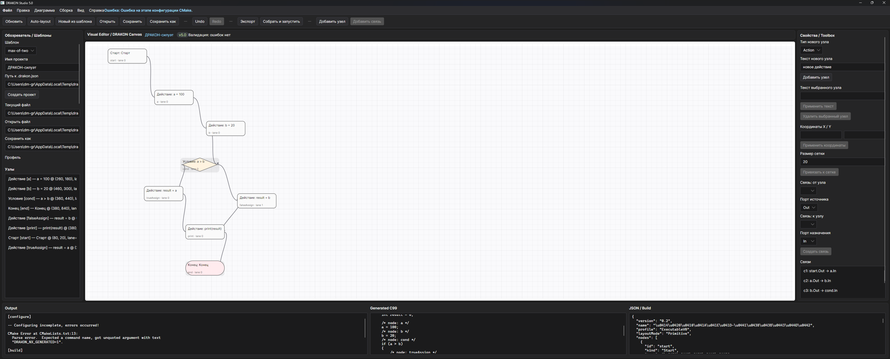

# DRAKON Studio

# DRAKON

DRAKON — инженерно-строгая система визуального алгоритмирования в духе ДРАКОН с кроссплатформенным desktop-редактором на Avalonia XAML и генерацией C-кода.

## Почему не WPF

Требование «WPF XAML кроссплатформенно» технически противоречиво.

- WPF — только Windows.
- Avalonia — XAML/MVVM-подход, близкий к WPF, но реально кроссплатформенный.

Поэтому редактор реализуется на **Avalonia UI**.

## Состав решения

- `src/Core` — доменная модель языка
- `src/Validation` — валидация диаграмм
- `src/Serialization` — сохранение/загрузка JSON
- `src/CodeGen` — генерация C99-кода
- `src/Build` — экспорт `main.c` и `CMakeLists.txt`, orchestration внешней сборки
- `src/Editor` — desktop-редактор
- `tests/Unit/*` — unit tests
- `tests/Golden/*` — golden tests кодогенерации
- `docs` — архитектура, спецификация и дорожная карта

## Сборка

Требуется:
- .NET SDK 8.0+
- CMake 3.20+
- C-компилятор в PATH (`gcc`, `clang` или MSVC через генератор CMake)

Команды:

```bash
dotnet restore
dotnet build DRAKON-NX.sln
dotnet test DRAKON-NX.sln
```

Запуск редактора:

```bash
dotnet run --project src/Editor/Editor.csproj
```

## Состояние шага 5

Реализованы:
- базовая генерация C99;
- экспорт generated C-кода в отдельный каталог;
- генерация `CMakeLists.txt`;
- сервис `CMakeBuildService` для конфигурации, сборки и запуска бинарника;
- unit tests для экспортера;
- предпросмотр `main.c`, `CMakeLists.txt` и build pipeline в редакторе.

## Пример ручной сборки exported проекта

```bash
cmake -S ./out/max_of_two -B ./out/max_of_two/build
cmake --build ./out/max_of_two/build --config Release
./out/max_of_two/build/max_of_two_app
```

Точный путь к бинарнику зависит от генератора CMake и платформы.


## Текущий этап

Шаг 6 добавляет интерактивные команды экспорта, сборки и запуска generated C-проекта через CMake прямо из Avalonia-редактора.

## CLI

Проект теперь включает консольный инструмент `drakon-nx`.

Примеры использования:

- `dotnet run --project src/Cli/Cli.csproj -- validate samples/hello-world/sample.drakon.json`
- `dotnet run --project src/Cli/Cli.csproj -- generate samples/max-of-two/sample.drakon.json ./out/max-of-two`
- `dotnet run --project src/Cli/Cli.csproj -- build samples/max-of-two/sample.drakon.json ./out/max-of-two`


## Preview

